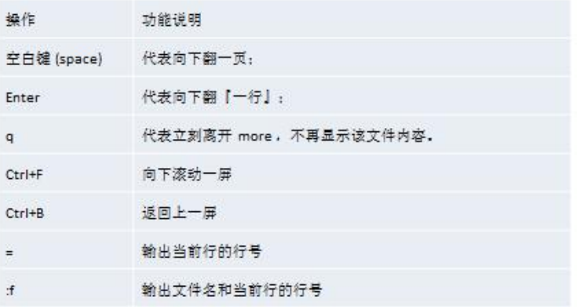
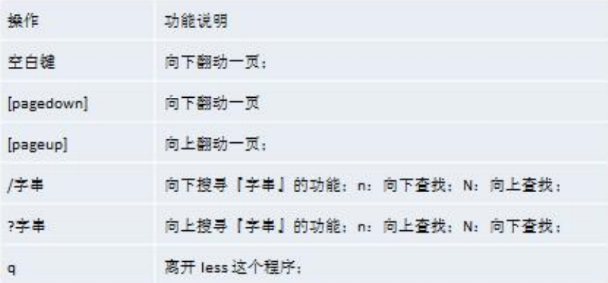
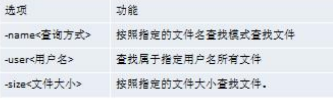

# Linux

## 一、关机、重启

### 1.立即关机

> 指令 ：shutdown
>
> 指令 ：halt

### 2.定时关机

> 指令 ：shutdown -h -[关机时间]

### 3.重启

> 指令 ：shutdown -r now
>
> 指令 ：reboot

### 4.把内存中的数据同步到磁盘

> 指令 ：sync

## 二、用户登录和注销

### 1.注销

>  指令 ：logout

## 三、用户管理

### 1.添加用户

> 指令 ：useradd [选项] 用户名
>
> 指令 ：useradd -d 指定目录名 用户名

### 2.删除用户

> 指令 ：userdel 用户名
>
> + 删除用户并保留家目录
>   + 指令 ： userdel 用户名
> + 删除用户不保留家目录
>   + 指令 ：userdel -r 用户名

### 3.查询用户信息

> 指令 ： id 用户名

### 4.切换用户

> 指令 ：su - 用户名
>
> + 注意 ：高权限用户切换到低权限用户时不需要密码
> + 指令 ：exit
>   + 退出到高权限用户

## 四、用户组管理

### 1.添加组

> 指令 ：groupadd 组名

### 2.删除组

> 指令 ：groupdel 组名

### 3.指定用户组

>指令 ：useradd -g 用户组 用户名

### 4.修改用户组

>usermod -g 新用户组 用户名

## 五、指令运行级别

1.运行级别说明： 

> 0 ：关机 
>
> 1 ：单用户【找回丢失密码】 
>
> 2：多用户状态没有网络服务 
>
> 3：多用户状态有网络服务 
>
> 4：系统未使用保留给用户 
>
> 5：图形界面 
>
> 6：系统重启
>
> `注意：常用运行级别是 3 和 5 ，要修改默认的运行级别可改文件 /etc/inittab 的 id:5:initdefault:这一行中的数字`

### 2.运行级别切换

>  指令 ：init [1234567]

### 3.面试题

> + 如何找回 root 密码，如果我们不小心，忘记 root 密码，怎么找回。 
>   + 思路： 进入到 单用户模式，然后修改 root 密码。因为进入单用户模式，root 不需要密码就可以登录。
>
> + 总结
>   + 开机->在引导时输入 回车键-> 看到一个界面输入 e -> 看到一个新的界面，选中第二行（编辑 内核）在输入 e-> 在这行最后输入空格，再输入1 ,再输入 回车键->再次输入 b ,这时就会进入到单用户模式。 这时，我们就进入到单用户模式，使用 passwd 指令来修改 root 密码。 

## 六、帮助指令

### 3.man命令

> 功能描述：获得帮助信息
>
> 指令 ：man [命令或配置文件]

### 2.help命令 

>功能描述：获得 shell 内置命令的帮助信息
>
>指令 ：help [命令或配置文件]

## 七、文件目录指令

### 1.pwd 命令

> 功能描述：显示当前工作目录的绝对路径
>
> 指令 ：pwd

### 2.ls命令

> + 基本语法
>   + ls [选项] [目录或是文件] 
>
> + 常用选项
>   + -a ：显示当前目录所有的文件和目录，包括隐藏的。 
>   + -l ：以列表的方式显示信息

### 3.cd 命令

> + 功能描述：切换到指定目录
> + 基本语法
>   + cd [参数] (功能描述：切换到指定目录)
>
> 指令 ：cd ~ 或者 cd ：回到自己的家目录 
>
> 指令 ：cd .. 回到当前目录的上一级目录 

### 4.mkdir 命令

>+ 功能描述：用于创建目录
> + 基本语法 
> + mkdir [选项] 要创建的目录 
>+ 常用选项 
>  + -p ：创建多级目录

### 5.rmdir 命令

> + 功能描述：删除空目录
> + 基本语法 
>  + rmdir [选项] 要删除的空目录 
> + 使用细节
>   + rmdir 删除的是空目录，如果目录下有内容时无法删除的。 
>   + 提示：如果需要删除非空目录，需要使用 rm -rf 要删除的目录

### 6.touch 命令

> + 功能描述：创建空文件
> + 基本语法
>   + touch 文件名称

### 7.cp 命令

> + 功能描述：拷贝文件到指定目录
> + 基本语法 
>  + cp [选项] source dest 
> + 常用选项
>   + -r ：递归复制整个文件夹

### 8.rm 命令

> + 功能描述：移除【删除】文件或目录
> + 基本语法
>  + rm [选项] 要删除的文件或目录 
> + 常用选项
>   + -r ：递归删除整个文件夹 
>   + -f ： 强制删除不提示 

### 9.mv 命令

> + 功能描述：移动文件与目录或重命名
> + 基本语法
>   + mv oldNameFile newNameFile (重命名) 
>   + mv /temp/movefile /targetFolder (移动文件) 

### 10.cat 命令

> + 功能描述：查看文件内容，是以只读的方式打开
> + 基本语法
>  + cat [选项] 要查看的文件 
> + 常用选项
>
>   + -n ：显示行号
>+ 使用细节 
> 
>  + cat 只能浏览文件，而不能修改文件，为了浏览方便，一般会带上 管道命令 | more 
> 
>  + cat 文件名 | more [分页浏览] 

### 11.more 命令

> + 功能描述：它以全屏幕的方式按页显示文本文件的内容
> + 描述 ：more 指令是一个基于 VI 编辑器的文本过滤器，它以全屏幕的方式按页显示文本文件的内容。more 指令中内置了若干快捷键，详见操作说明 
> + 基本语法
>   + more 要查看的文件

### 12.less 命令

> + 功能描述 : 分屏查看文件内容
> + 描述 ：less 指令用来分屏查看文件内容，它的功能与 more 指令类似，但是比 more 指令更加强大，支持 各种显示终端。less 指令在显示文件内容时，并不是一次将整个文件加载之后才显示，而是根据显示 需要加载内容，**对于显示大型文件具有较高的效率**。 
> + 基本语法
>   + less 要查看的文件

### 13.">" 和 ">>"命令

> + 功能描述：
>   + \> 输出重定向 : 会将原来的文件的内容覆盖 
>   + \>> 追加： 不会覆盖原来文件的内容，而是追加到文件的尾部
> + 基本语法
>   +  ls -l >文件 （列表的内容写入文件 a.txt 中（覆盖写））
>   + ls -al >>文件 （列表的内容追加到文件 aa.txt 的末尾） 
>   + cat 文件 1 > 文件 2 （将文件 1 的内容覆盖到文件 2）
>   + echo "内容" >> 文件 （将内容写入到文件中）
> + 说明：ls -l > a.txt , 将 ls -l 的显示的内容覆盖写入到 a.txt 文件，如果该文件不存在，就创建该文 件

### 14.echo命令 

> + 功能描述 ：输出内容到控制台
> + 基本语法
>   + echo [选项] [输出内容] 

### 15.head 命令

> + 功能描述 ：显示文件的开头部分内容，默认情况下 head 指令显示文件的前 10 行内容
> + 基本语法
>   + head 文件 (查看文件头 10 行内容) 
>   + head -n 5 文件 (查看文件头 5 行内容，5 可以是任意行数)

### 16.tail 命令

> + 功能描述 ：输出文件中尾部的内容，默认情况下 tail 指令显示文件的后 10 行内容
> + 基本语法
>   +  tail 文件 （查看文件后 10 行内容） 
>   + tail -n 5 文件 （查看文件后 5 行内容，5 可以是任意行数） 
>   + `tail -f 文件` (实时追踪该文档的所有更新，工作经常使用） 

### 17.ln 命令

> + 功能描述 ：软链接也叫符号链接，类似于 windows 里的快捷方式，主要存放了链接其他文件的路径
> + 基本语法
>   + ln -s [原文件或目录] [软链接名] （给原文件创建一个软链接）
>   + rm -rf 软链接名（注意：删除软链接文件时，不要带/，否则提示资源忙）

### 18.history 命令

> + 功能描述 ：查看已经执行过历史命令,也可以执行历史指令
> + 基本语法
>   + history （查看已经执行过历史命令） 

### 19.date 命令

> + 功能描述 ：显示当前日期
>+ 基本语法
> +  date （显示当前时间） 
>  
> +  date +%Y （显示当前年份） 
>  
> + date +%m （显示当前月份） 
>  
> + date +%d （显示当前是哪一天） 
>   + date "+%Y-%m-%d %H:%M:%S"（显示年月日时分秒）
>   + date -s 字符串时间 （比如设置成 2018-10-10 11:22:22）

### 20.cal命令

>+ 功能描述 ：查看日历指令
>+ 基本语法
> + cal [选项] (不加选项，显示本月日历） 

### 21.find 命令

> + 功能描述 ：从指定目录向下递归地遍历其各个子目录，将满足条件的文件或者目录显示在终端
>
> + 基本语法
>
>   + find [搜索范围] [选项] 
>
>   + 按文件名：根据名称查找/home 目录下的 hello.txt 文件
>
>     + find /home -name hello.txt
>
>   + 按拥有者：查找/opt 目录下，用户名称为 nobody 的文件
>
>     + find /opt -user -nobody
>
>   + 查找整个 linux 系统下大于 20m 的文件（+n 大于 -n 小于 
>
>     n 等于）
>
>     + find / -size +20M
>     + find / -size -20M
>     + find / -size 20M
>     + find / -size +20480K
>
>   + 查询 / 目录下，所有 .txt 的文件
>
>   + find / -name *.txt

### 22.locate 命令

> + 功能描述 ：快速定位文件路径
> + 描述 ：locaate 指令可以快速定位文件路径。locate 指令利用事先建立的系统中所有文件名称及路径的 locate 数据库实现快速定位给定的文件。Locate 指令无需遍历整个文件系统，查询速度较快。为了保 证查询结果的准确度，管理员必须定期更新 locate 时刻。
> + 基本语法
>   + locate 搜索文件 
> + 特别说明 
>   + 由于 locate 指令基于数据库进行查询，所以第一次运行前，必须使用 updatedb 指令创建 locate 数 据库。

